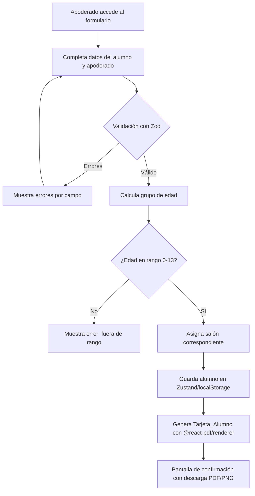
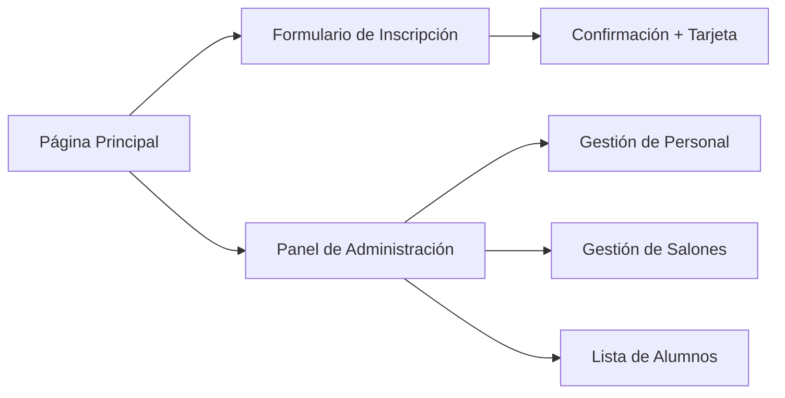

# Documento de Diseño Técnico
## Sistema Web del Ministerio de Niños

---

## Resumen de Investigación

Antes de escribir el diseño, se investigaron las siguientes áreas:

- **Generación de PDF en el navegador**: La librería [`@react-pdf/renderer`](https://react-pdf.org/) permite crear documentos PDF declarativamente con componentes React, tanto en cliente como en servidor. Es la opción más adecuada para generar tarjetas de alumno con diseño personalizado.
- **Validación de formularios**: La combinación [`react-hook-form`](https://react-hook-form.com/) + [`zod`](https://zod.dev/) es el estándar actual para formularios TypeScript en React/Next.js: validación declarativa, inferencia de tipos automática y mensajes de error por campo.
- **Gestión de estado global**: [`Zustand`](https://zustand-demo.pmnd.rs/) con middleware `persist` (localStorage) es la solución más ligera y adecuada para una aplicación sin backend, manteniendo el estado entre sesiones.
- **Framework**: Next.js 14 (App Router) con TypeScript y Tailwind CSS ofrece la mejor combinación de rendimiento, DX y soporte responsive para este tipo de aplicación.

---

## Visión General

El sistema es una **aplicación web SPA/SSG** construida con Next.js 14 que permite al Ministerio de Niños de una iglesia gestionar su estructura organizacional, inscribir alumnos y generar tarjetas de identificación descargables. No requiere backend propio: toda la persistencia se realiza en `localStorage` del navegador, lo que simplifica el despliegue y elimina costos de infraestructura.

### Objetivos de Diseño

- Interfaz moderna, responsive y accesible (320px–1920px)
- Flujo de inscripción simple para apoderados sin conocimientos técnicos
- Generación de tarjeta PDF/PNG en el cliente, sin servidor
- Gestión de personal y salones para administradores del ministerio
- Carga inicial < 3 segundos en conexión de 10 Mbps

### Decisiones de Diseño Clave

| Decisión | Elección | Justificación |
|---|---|---|
| Framework | Next.js 14 App Router | SSG, routing, optimización de imágenes |
| Estilos | Tailwind CSS | Responsive rápido, consistencia visual |
| Formularios | react-hook-form + zod | Validación tipada, mensajes por campo |
| Estado global | Zustand + persist | Ligero, sin boilerplate, persiste en localStorage |
| PDF | @react-pdf/renderer | Diseño declarativo, sin servidor |
| Lenguaje | TypeScript | Seguridad de tipos en modelos de datos |

---

## Arquitectura

La aplicación sigue una arquitectura **cliente-side con persistencia local**, organizada en capas:

```
┌─────────────────────────────────────────────────────────┐
│                    Capa de Presentación                  │
│  Next.js Pages / App Router  +  Tailwind CSS Components  │
├─────────────────────────────────────────────────────────┤
│                    Capa de Lógica                        │
│   Hooks personalizados  +  Servicios de dominio          │
│   (asignación de salón, validación de edad, etc.)        │
├─────────────────────────────────────────────────────────┤
│                    Capa de Estado                        │
│         Zustand Stores  (con middleware persist)         │
├─────────────────────────────────────────────────────────┤
│                    Capa de Persistencia                  │
│              localStorage (JSON serializado)             │
└─────────────────────────────────────────────────────────┘
```

### Diagrama de Flujo Principal



### Diagrama de Navegación



---

## Componentes e Interfaces

### Estructura de Directorios

```
src/
├── app/
│   ├── page.tsx                    # Página principal / landing
│   ├── inscripcion/
│   │   └── page.tsx                # Formulario de inscripción
│   ├── confirmacion/
│   │   └── page.tsx                # Confirmación + descarga tarjeta
│   └── admin/
│       ├── page.tsx                # Panel de administración
│       ├── personal/
│       │   └── page.tsx            # Gestión de personal
│       ├── salones/
│       │   └── page.tsx            # Gestión de salones
│       └── alumnos/
│           └── page.tsx            # Lista de alumnos
├── components/
│   ├── ui/                         # Componentes base (Button, Input, Card...)
│   ├── forms/
│   │   ├── FormularioInscripcion.tsx
│   │   └── FormularioPersonal.tsx
│   ├── tarjeta/
│   │   ├── TarjetaAlumno.tsx       # Componente visual de la tarjeta
│   │   └── TarjetaAlumnoPDF.tsx    # Versión @react-pdf/renderer
│   ├── admin/
│   │   ├── TablaPersonal.tsx
│   │   ├── TablaSalones.tsx
│   │   └── TablaAlumnos.tsx
│   └── layout/
│       ├── Navbar.tsx
│       └── Footer.tsx
├── stores/
│   ├── alumnosStore.ts             # Zustand store de alumnos
│   ├── personalStore.ts            # Zustand store de personal
│   └── salonesStore.ts             # Zustand store de salones
├── lib/
│   ├── asignacionSalon.ts          # Lógica de asignación por edad
│   ├── validaciones.ts             # Esquemas Zod
│   └── generarTarjeta.ts           # Utilidades de generación PDF/PNG
└── types/
    └── index.ts                    # Tipos TypeScript globales
```

### Interfaces de Componentes Clave

#### `FormularioInscripcion`
```typescript
interface FormularioInscripcionProps {
  onExito: (alumno: Alumno, apoderado: Apoderado) => void;
}
```

#### `TarjetaAlumno`
```typescript
interface TarjetaAlumnoProps {
  alumno: Alumno;
  apoderado: Apoderado;
  salon: Salon;
  modo: 'preview' | 'pdf';
}
```

#### `TablaPersonal`
```typescript
interface TablaPersonalProps {
  personal: Personal[];
  onEditar: (id: string) => void;
  onEliminar: (id: string) => void;
}
```

---

## Modelos de Datos

### Tipos Principales (TypeScript)

```typescript
// Grupos de edad disponibles
type GrupoEdad = 'Cuna' | 'Preescolar' | 'PrimariaAlta' | 'PrimariaBaja';

// Roles del ministerio
type Rol = 'Director_General' | 'Lider_General' | 'Coordinadora' | 'Maestro' | 'Auxiliar';

// Relación del apoderado con el alumno
type RelacionApoderado = 'padre' | 'madre' | 'tutor';

// Sexo del alumno
type Sexo = 'masculino' | 'femenino';
```

### Entidad: Alumno

```typescript
interface Alumno {
  id: string;                        // UUID generado al registrar
  nombreCompleto: string;
  fechaNacimiento: string;           // ISO 8601: "YYYY-MM-DD"
  sexo: Sexo;
  fotografiaUrl?: string;            // Base64 o URL de objeto local
  salonId: string;                   // Referencia al Salon asignado
  apoderadoId: string;               // Referencia al Apoderado
  fechaRegistro: string;             // ISO 8601 timestamp
}
```

### Entidad: Apoderado

```typescript
interface Apoderado {
  id: string;
  nombreCompleto: string;
  relacion: RelacionApoderado;
  telefono: string;
  email: string;
}
```

### Entidad: Salon

```typescript
interface Salon {
  id: string;
  nombre: string;                    // Ej: "Grupo Cuna", "Grupo Preescolar"
  grupoEdad: GrupoEdad;
  edadMinima: number;                // En años
  edadMaxima: number;                // En años
  maestroId?: string;                // Referencia al Personal con rol Maestro
  auxiliaresIds: string[];           // Referencias a Personal con rol Auxiliar
}
```

### Entidad: Personal

```typescript
interface Personal {
  id: string;
  nombreCompleto: string;
  rol: Rol;
  telefono: string;
  email: string;
  salonesIds: string[];              // Salones asignados (para Maestros/Coordinadoras)
  maestroAsignadoId?: string;        // Solo para Auxiliares: maestro al que apoyan
}
```

### Configuración de Salones (constante)

```typescript
const CONFIGURACION_SALONES: Record<GrupoEdad, { edadMinima: number; edadMaxima: number; nombre: string }> = {
  Cuna:         { edadMinima: 0,  edadMaxima: 2,  nombre: 'Grupo Cuna' },
  Preescolar:   { edadMinima: 3,  edadMaxima: 5,  nombre: 'Grupo Preescolar' },
  PrimariaBaja: { edadMinima: 6,  edadMaxima: 10, nombre: 'Grupo Primaria Baja' },
  PrimariaAlta: { edadMinima: 11, edadMaxima: 13, nombre: 'Grupo Primaria Alta' },
};
```

### Esquemas de Validación Zod

```typescript
const SchemaAlumno = z.object({
  nombreCompleto: z.string().min(2, 'El nombre debe tener al menos 2 caracteres'),
  fechaNacimiento: z.string().regex(/^\d{4}-\d{2}-\d{2}$/, 'Formato de fecha inválido'),
  sexo: z.enum(['masculino', 'femenino']),
  fotografiaUrl: z.string().optional(),
});

const SchemaApoderado = z.object({
  nombreCompleto: z.string().min(2, 'El nombre debe tener al menos 2 caracteres'),
  relacion: z.enum(['padre', 'madre', 'tutor']),
  telefono: z.string().min(7, 'Teléfono inválido'),
  email: z.string().email('Correo electrónico inválido'),
});

const SchemaInscripcion = z.object({
  alumno: SchemaAlumno,
  apoderado: SchemaApoderado,
});
```

### Estructura del Estado Zustand

```typescript
// alumnosStore.ts
interface AlumnosState {
  alumnos: Alumno[];
  apoderados: Apoderado[];
  agregarAlumno: (alumno: Alumno, apoderado: Apoderado) => void;
  obtenerAlumnoPorId: (id: string) => Alumno | undefined;
  obtenerAlumnosPorSalon: (salonId: string) => Alumno[];
}

// personalStore.ts
interface PersonalState {
  personal: Personal[];
  agregarPersonal: (p: Personal) => void;
  actualizarPersonal: (id: string, datos: Partial<Personal>) => void;
  eliminarPersonal: (id: string) => boolean; // false si tiene alumnos asignados
}

// salonesStore.ts
interface SalonesState {
  salones: Salon[];
  inicializarSalones: () => void;             // Crea los 4 salones base
  asignarMaestro: (salonId: string, maestroId: string) => void;
  asignarAuxiliar: (salonId: string, auxiliarId: string) => void;
}
```

---

## Propiedades de Corrección

*Una propiedad es una característica o comportamiento que debe mantenerse verdadero en todas las ejecuciones válidas del sistema — esencialmente, una declaración formal sobre lo que el sistema debe hacer. Las propiedades sirven como puente entre las especificaciones legibles por humanos y las garantías de corrección verificables por máquinas.*


### Propiedad 1: Asignación de salón por edad es total y correcta

*Para cualquier* fecha de nacimiento que resulte en una edad entre 0 y 13 años (inclusive), la función `asignarSalon` debe retornar exactamente un `GrupoEdad` cuyo rango de edad contenga la edad calculada del alumno.

**Valida: Requisitos 1.4, 2.2**

---

### Propiedad 2: Edades fuera de rango son rechazadas

*Para cualquier* fecha de nacimiento que resulte en una edad mayor a 13 años o negativa, la función `asignarSalon` debe retornar `null` o lanzar un error indicando que el alumno no cumple el rango de edad.

**Valida: Requisito 2.3**

---

### Propiedad 3: Validación de formulario de inscripción rechaza datos incompletos

*Para cualquier* objeto de inscripción al que le falte al menos un campo obligatorio (nombre del alumno, fecha de nacimiento, sexo, nombre del apoderado, relación, teléfono o email), el esquema Zod debe retornar al menos un error de validación, y los datos ya ingresados en los campos válidos deben permanecer intactos en el estado del formulario.

**Valida: Requisitos 3.1, 3.2, 3.3, 3.4**

---

### Propiedad 4: La tarjeta generada contiene todos los datos requeridos

*Para cualquier* combinación válida de `(Alumno, Apoderado, Salon)`, la tarjeta generada debe contener el nombre completo del alumno, su fecha de nacimiento, el nombre del grupo de salón asignado, el nombre del apoderado y el teléfono de contacto. Además, si el alumno tiene `fotografiaUrl` definida, la tarjeta debe incluirla.

**Valida: Requisitos 4.1, 4.2, 4.3**

---

### Propiedad 5: Un salón tiene exactamente un maestro asignado

*Para cualquier* salón, asignar un maestro debe resultar en que el campo `maestroId` del salón sea igual al id del maestro asignado. Si se asigna un segundo maestro, el primero debe ser reemplazado (no acumulado).

**Valida: Requisito 1.2**

---

### Propiedad 6: La asignación de personal se refleja en el estado

*Para cualquier* miembro del personal (Maestro o Auxiliar) y cualquier salón o maestro válido, tras ejecutar la operación de asignación, el id del destino debe aparecer en la colección correspondiente del personal (`salonesIds` para maestros, `maestroAsignadoId` para auxiliares).

**Valida: Requisitos 6.2, 6.3**

---

### Propiedad 7: No se puede eliminar un maestro con alumnos asignados

*Para cualquier* maestro que tenga al menos un alumno asignado en su salón, la función `eliminarPersonal` debe retornar `false` y el maestro debe permanecer en el store sin cambios.

**Valida: Requisito 6.4**

---

## Manejo de Errores

### Errores de Validación de Formulario

| Situación | Comportamiento |
|---|---|
| Campo obligatorio vacío | Mensaje de error junto al campo; datos restantes intactos |
| Email con formato inválido | Mensaje "Correo electrónico inválido" junto al campo email |
| Teléfono con menos de 7 dígitos | Mensaje "Teléfono inválido" junto al campo teléfono |
| Fecha de nacimiento inválida | Mensaje "Formato de fecha inválido" |
| Nombre con menos de 2 caracteres | Mensaje "El nombre debe tener al menos 2 caracteres" |

### Errores de Lógica de Negocio

| Situación | Comportamiento |
|---|---|
| Edad del alumno > 13 años | Mensaje: "El alumno no cumple el rango de edad del ministerio (0–13 años)" |
| Edad del alumno < 0 (fecha futura) | Mensaje: "La fecha de nacimiento no puede ser una fecha futura" |
| Intento de eliminar maestro con alumnos | Advertencia modal: "Este maestro tiene alumnos asignados. Reasigne los alumnos antes de continuar." |
| Foto con formato no soportado | Mensaje: "Solo se aceptan imágenes en formato JPG, PNG o WebP" |
| Foto mayor a 5MB | Mensaje: "La imagen no debe superar los 5MB" |

### Errores de Estado / Persistencia

| Situación | Comportamiento |
|---|---|
| localStorage no disponible | La app funciona en memoria; se muestra aviso de que los datos no se guardarán |
| Datos corruptos en localStorage | Se inicializa el store vacío y se muestra aviso al usuario |

---

## Estrategia de Pruebas

### Enfoque Dual

La estrategia combina **pruebas de ejemplo** para comportamientos específicos y **pruebas basadas en propiedades** para invariantes universales.

### Librería de Property-Based Testing

Se utilizará **[fast-check](https://fast-check.dev/)** (TypeScript/JavaScript), que es la librería de PBT más madura para el ecosistema React/Next.js. Cada prueba de propiedad se ejecutará con un mínimo de **100 iteraciones**.

### Pruebas de Propiedad (fast-check)

Cada propiedad del diseño se implementa como un test con `fc.assert(fc.property(...))`:

| Propiedad | Función bajo prueba | Generadores |
|---|---|---|
| P1: Asignación correcta por edad | `asignarSalon(fechaNacimiento)` | `fc.date({ min: hace13años, max: hoy })` |
| P2: Edades fuera de rango rechazadas | `asignarSalon(fechaNacimiento)` | `fc.date({ min: hace100años, max: hace14años })`|
| P3: Validación rechaza datos incompletos | `SchemaInscripcion.safeParse(datos)` | `fc.record(...)` con campos omitidos aleatoriamente |
| P4: Tarjeta contiene todos los datos | `generarDatosTarjeta(alumno, apoderado, salon)` | `fc.record(...)` con datos válidos aleatorios |
| P5: Salón tiene exactamente un maestro | `asignarMaestro(salonId, maestroId)` | `fc.uuid()` para ids |
| P6: Asignación de personal en estado | `agregarPersonal / asignarMaestro` | `fc.record(...)` con datos de personal |
| P7: No eliminar maestro con alumnos | `eliminarPersonal(id)` | `fc.record(...)` con maestro que tiene alumnos |

**Formato de etiqueta para cada test:**
```
// Feature: ministerio-ninos-iglesia, Propiedad N: <texto de la propiedad>
```

### Pruebas de Ejemplo (Vitest)

- Envío exitoso del formulario → mensaje de confirmación visible
- Envío con campos vacíos → errores por campo visibles, datos no borrados
- Alumno con fotografía → tarjeta incluye imagen
- Descarga de tarjeta → produce blob de tipo `application/pdf`
- Panel de administración con rol Director_General → lista de personal visible
- Perfil de maestro → muestra auxiliares y alumnos asignados
- Indicador de carga → visible cuando operación supera 500ms

### Pruebas de Humo (Smoke Tests)

- Los 4 grupos de salón existen con los rangos correctos al inicializar el store
- La jerarquía de roles está definida en el orden correcto
- El formulario renderiza en viewport 320px sin overflow horizontal
- La página principal carga en < 3s (medición con Lighthouse CI)

### Cobertura Objetivo

- Lógica de dominio (`asignacionSalon.ts`, `validaciones.ts`): ≥ 90%
- Stores Zustand: ≥ 80%
- Componentes de formulario: ≥ 70%
